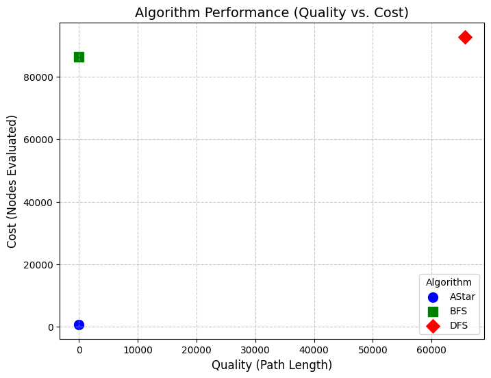

# CI2024_lab3

## Proposed Algorithms

### Minimum Path-Search Approach
This project implements and compares three path-search algorithms for solving the **Gem Puzzle** problem:

- #### BFS Algorithm (Breadth First Search)
  Explores all nodes at the present depth before moving on to nodes at the next depth level.
  
- #### DFS Algorithm (Depth First Search)
  Explores as far as possible along each branch before backtracking.
  
- #### A* Algorithm
  Combines the path cost from the start node and a heuristic estimate to the goal node for efficient searching.

---

## Notation and Acronyms

- **BFS**: Breadth First Search algorithm
- **DFS**: Depth First Search algorithm
- **A\***: A-star algorithm
- **Quality**: Length of the final path; the minimum path needed to reach the goal state (sorted puzzle) from the random starting state.
- **Cost**: Number of nodes evaluated during the search process.
- **Running Time**: Time taken to complete the search.

---

## Contents

### Overview
The **Gem Puzzle** involves rearranging tiles into a goal configuration. A random, solvable initial state is generated by scrambling the goal state, and the shortest path to the goal is computed using different algorithms.

This project implements **Path Search** algorithms and saves the main results in the file `output.txt`.

### Implementations

- **BFS**: This algorithm systematically explores all nodes at the current depth before moving to the next level. While it guarantees the shortest path, it requires significant memory for larger puzzles.
  
- **DFS**: DFS explores one path deeply before backtracking. Although memory-efficient, it is not optimal and can lead to excessively long runtimes due to exploring irrelevant branches.

- **A\***: The A* algorithm uses a heuristic, specifically the **Manhattan Distance**, to guide its search. It balances exploration and path optimality, making it the most efficient approach among the three for larger puzzle sizes.

---

## Observations

1. **Puzzle Complexity**:
   - For a 3x3 puzzle, all algorithms can solve the problem within a reasonable timeframe, though their performance varies.
   - For puzzles larger than 3x3 (e.g., 4x4 or 5x5), only the A* algorithm executes in a practical amount of time due to its heuristic guidance.

2. **Algorithm Efficiency**:
   - BFS and DFS exhibit exponential growth in runtime and memory usage as the puzzle size increases.
   - A* leverages the heuristic to prune unnecessary branches, leading to significantly lower costs and higher efficiency.

3. **DFS Limitations**:
   - DFS's deep exploration strategy can lead to inefficiencies as it does not guarantee the shortest path.

---

## Results

The table below summarizes the results for a **3x3 Gem Puzzle**, derived from a single execution of each algorithm. These metrics highlight the trade-offs between path optimality, computational cost, and runtime.

| Algorithm                        | Quality |  Cost  | Running time (seconds) |
|----------------------------------|---------|--------|------------------------|
| A*       | 22      | 700    | 0.10939980             |
| Breadth First Search (BFS)         | 22      | 86437  | 3.97290080             |
| Depth First Search (DFS)                               | 65660   | 92817  | 4.66729150             |

### Quality vs Cost Plot

The following plot shows the relationship between Quality (X-axis) and Cost (Y-axis) for the different algorithms.

The more bottom-left the point is, the better the algorithm performs.

---

## Conclusions and Insights

1. **A\* Outperforms Other Algorithms**:
   - A* consistently finds the shortest path with the lowest cost due to its heuristic-driven search.
   - The Manhattan Distance heuristic proves effective for guiding the algorithm in tile-based puzzles.

2. **BFS is Reliable but Costly**:
   - BFS guarantees an optimal solution but suffers from high memory and computational costs as puzzle size increases.

3. **DFS is Unsuitable for Large Problems**:
   - DFS often evaluates unnecessary nodes and takes excessive time for deeper searches.

---

## References and Collaborations

- **Book**: S. Russell, P. Norvig; *“Artificial Intelligence: A Modern Approach” (4th Edition)*
- **Teaching Material**: Course slides and notes from CI2024.
- **Colleagues**: Gabriele Raffaele

---

## Usage Instructions

1. Run the `notebook` file provided to execute the algorithms.
2. Results will be saved in the `output.txt` file for analysis.
3. Modify the puzzle size and scrambling steps in the code for customized experiments.

